# GREEN SKULL

**Identificação do Jogo:** Green Skull  
**Identificação do Grupo:**  
- Diogo Santos (up201806878)  
- Tomás Gonçalves(up201806763)

---

# Instalação

Para poder instalar este jogo basta fazer o download dos ficheiros, depois no sicstus(ou outro ambiente de prolog) fazer consult do ficheiro *green_skull.pl* depois disso basta escrever o predicado *play* e o jogo começa a correr.

# Descrição
**Introdução**

Green Skull é um jogo de tabuleiro disputado por dois jogadores. O material necessário para jogar é: um tabuleiro, peças redondas (8 verdes, 10 roxas e 10 brancas) e uma peça não redonda (geralmente em formato de crânio).

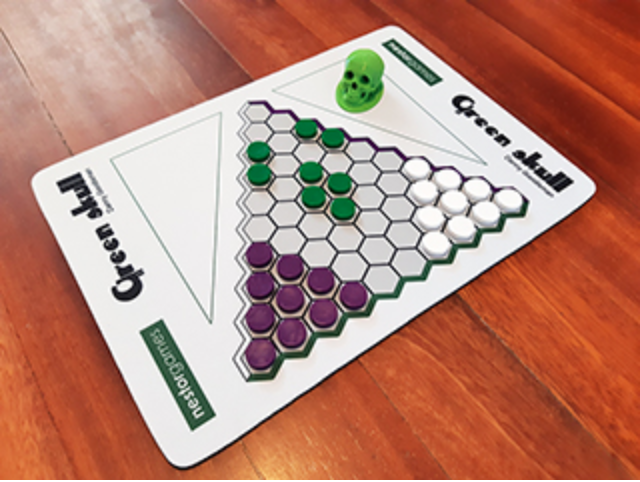

O tabuleiro é de formato triangular sendo que cada lado contém 10 células, e cada um destes lados apresenta bordas de cores correspondentes aos três tipos de peças.

Os três tipos de peças representam diferentes criaturas mitológicas (embora a representação seja apenas abstrata). As peças verdes são chamadas de Zombies, as brancas de Orcs e as roxas de Goblins.

**Instruções de jogo**

Ao iniciar o jogo, um jogador toma posse dos Goblins enquanto que o adversário controla os Orcs. O controlo das peças Zombie vai alternando entre os dois jogadores à medida que vão jogando (embora seja primeiro atribuído ao jogador que possui os goblins).

Ambos os jogadores podem efetuar um de dois movimentos possíveis:
-O primeiro é deslocar uma das suas peças para uma casa adjacente vazia.

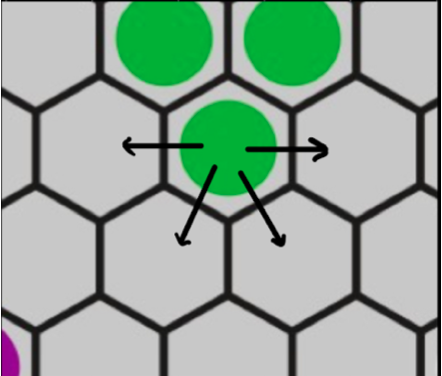

-Pode também efetuar um ou mais saltos em linha reta sobre outra peça (incluindo peças do próprio jogador) caindo numa casa vazia. Estas peças pelas quais a peça vai passando por cima vão sendo removidas do tabuleiro. Se o jogador que possui o crânio optar por este segundo movimento, deve ceder o crânio ao seu adversário tendo agora ele posse dos Zombies.

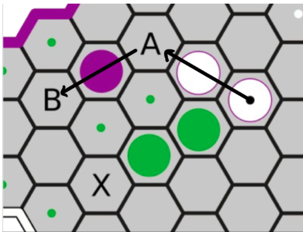

O jogador que possui o crânio pode ainda mover uma das peças zombies após cada jogada com as suas respetivas peças.

O jogo termina quando todas as peças de um tipo forem comidas ou estiverem em contacto com a borda da mesma cor.

 **Pontuação**

Vence a espécie que obtiver mais pontos de acordo com a seguinte contagem:

-cada espécie recebe 2 pontos por cada peça que toque a borda da sua cor
-cada espécie recebe 1 ponto por cada peça capturada que não seja da sua cor

Página do Jogo: https://nestorgames.com/rulebooks/GREENSKULL_EN.pdf

# Lógica do Jogo

## Representação interna do estado do jogo

O estado do jogo é representado através da estrutura *state(Board, Player, ZPlayer, XEliminated, OEliminated, ZEliminated)*.

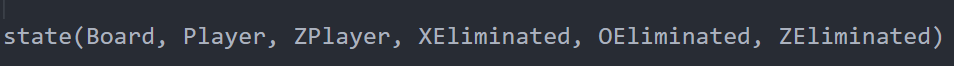

Nesta estrutura Board representa o tabuleiro de jogo, Player representa o jogador atual(*X*, *O* ou *Z*), ZPlayer representa o jogador que detém posso sobre o *green skull* (*X* ou *O*), ou seja, sobre os zombies, XEliminated representa o número de peças X eliminadas do tabuleiro, OEliminated representa o número de peças eliminadas do tabuleiro e finalmente ZEliminated representa o número de peças Z eliminadas do tabuleiro.

O tabuleiro triangular é representado através de uma lista de listas com a seguinte disposição:

**Estado inicial do jogo:**
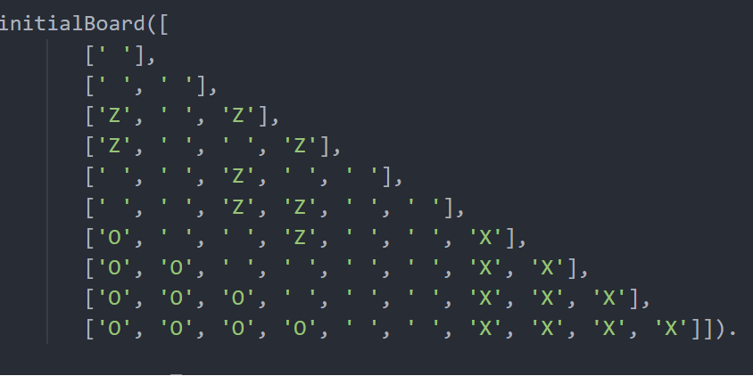

O tabuleiro é criado com as peças nas suas posições iniciais. As peças Zombie são representadas visualmente pela letra “Z”, Goblins por “O” e Orcs por “X”.

Os três tabuleiros seguintes representam estados de jogo intermédios. Podemos observar algumas peças movidas e outras retiradas do tabuleiro.

**Estados intermédios do jogo:**
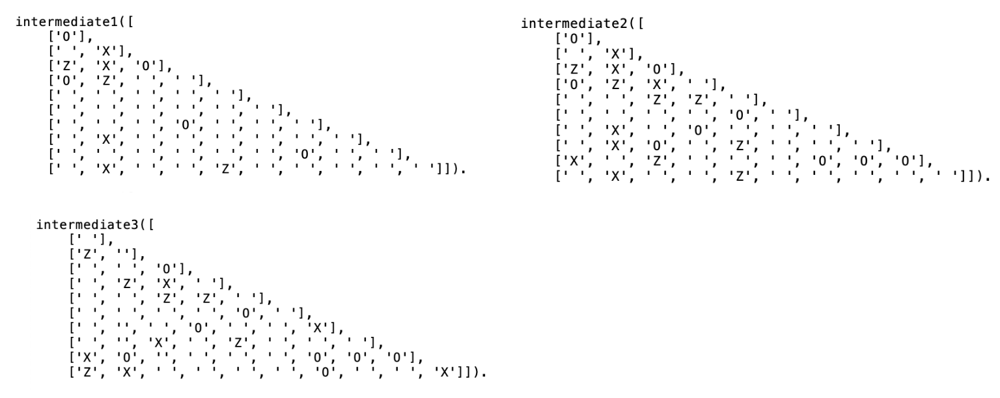

Esta última tabela mostra-nos o estado final do jogo. O jogo terminou pois todas as peças Zombie (“Z”) estão em contacto com a face do tabuleiro correspondente à sua cor (neste caso a base do triângulo).

**Estado final do jogo:**
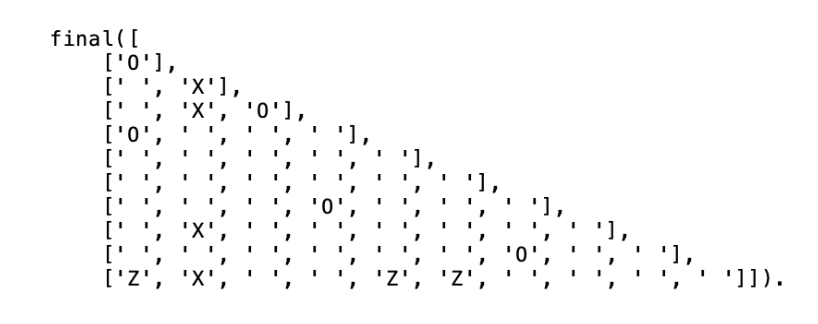

Guardamos a informação de qual o jogador que deve jogar através do facto que vamos alterando dinamicamente chamado player_turn e guarda uma string que indica qual é o jogador a jogar. Da mesma forma, representamos o detentor do crânio verde com o facto z_belongs_to que também contém uma string que nos diz qual dos dois jogadores controla os zombies nesse instante.
Em relação a peças eliminadas, temos também três factos que alternam dinamicamente: o_eliminated, z_eliminated e x_eliminated; estes factos contêm o número de peças eliminadas da sua espécie. Sempre que alguma destas peças é eliminada no respetivo facto, incrementamos o valor de peças eliminadas.
Em relação à representação das peças, são utilizadas strings como descrito anteriormente, cada uma situada na sua posição específica do tabuleiro.

## Visualização do Estado de jogo

Para se poder visualizar o estado atual do jogo temos de recorrer ao predicado display_game/2 que recebe como primeiro parámetro o estado atual do jogo e como segundo o jogador atual.

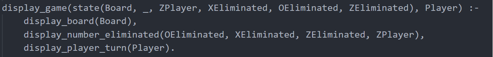

Este predicado recorre a outros três predicados que fazem o seguinte:

- display_board/1: recebe como parâmetro o tabuleiro atual de jogo e apresenta também as linhas e colunas de cada elemento para facilitar a escolha da peça a mover, tal como a casa para onde a mesma deve ser movida. Este predicado recorre a outro predicado “print_row1/1” que imprime a linha 1, este por sua vez chama o “print_row2/1” que imprime a linha 2 e assim sucessivamente até à linha 10. Na imagem que se segue é possivel observar a representação do tabuleiro inicial do jogo.

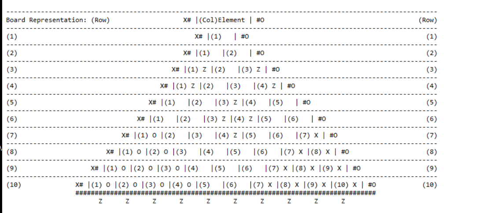

- display_number_eliminated/4: recebe nos três primeiros parâmetros o número de peças de cada tipo eliminadas e no quarto argumento recebe o jogador que detém posse sobre os zombies. O que este predicado faz é apresentar uma tabela indicativa do número de peças eliminadas de cada espécie e indicar também o jogador que possui a caveira.

- display_player_turn/1: recebe como primeiro parâmetro o jogador atual e apresenta no ecrã uma mensagem que indica quem é o jogador a fazer a próxima jogada. A imagem que se segue mostra o resultado destes dois últimos predicados.

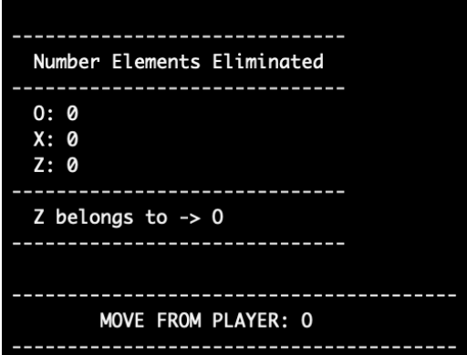

Em relação aos menus temos o seguinte: ao correr inicialmente o jogo é nos apresentado o menu principal no qual nos é pedido para escolher um dos três estilos de jogo: humano contra humano, humano contra computador ou computador contra computador.

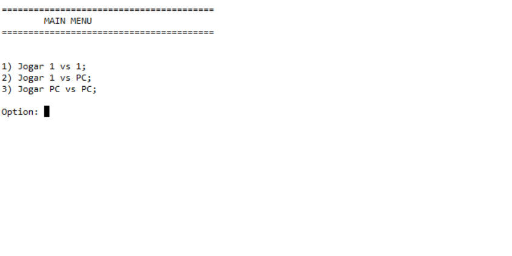

Para isto recorremos ao predicado main_menu/0 que por sua vez chama o display_main_menu/0 que simplesmente mostra o menu, recorremos também ao ask_menu_option/2 que vai pedir uma opção ao utilizador e ao mesmo tempo vai também validá-la e recorremos também ao predicado next_state/2 que com base no estado atual e na opção do utilizador vai decidir qual é o estado de jogo seguinte.

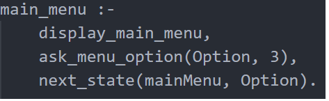

Temos outro menu no qual o utilizador pode selecionar qual a dificuldade do jogo(este menu só ocorre caso o utilizador tenha selecionado uma das opções de jogar com computador). Aqui o utilizador pode selecionar um de três niveís de dificuldade: fácil, médio ou difícil.

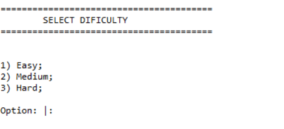

Para isto recorri ao predicado menu_select_difficulty/1 que por sua vez recorre ao predicado display_menu_select_difficulty/0 que simplesmente mostra o menu e ask_menu_option/2 que vai pedir uma opção ao utilizador e ao mesmo tempo vai também validá-la. Este predicado retorna a dificuldade selecionada pelo utilizador.

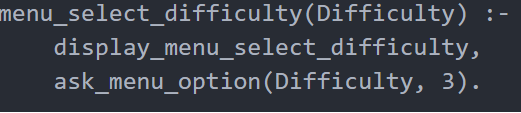

Por último temos também outro menu que só aparece caso o utilizador tenha selecionado a opção humano contra computador no qual é possível escolher qual das peças o computador será ou Os ou Xs.

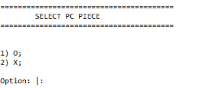

Para isso recorremos ao predicado menu_select_piece/1 que é idêntico ao predicado anterior. Simplesmente recorre ao predicado display_menu_select_piece/0 que mostra o menu e também recorre ao ask_menu_option/2 que vai pedir uma opção ao utilizador e ao mesmo tempo vai também validá-la. Este predicado retorna a peça selecionada pelo utilizador para o computador.

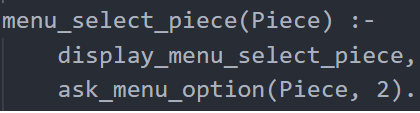

## Lista de jogadas válidas
É possível obter um conjunto de jogadas válidas através no predicado valid_moves/3. Este predicado recebe o estado de jogo Board e o Player, devolvendo uma lista ListOfMoves com todas as jogadas possíveis para esse jogador. A lista ListOfMoves é representada através de uma lista de listas. Cada uma das sub-listas contém por sua vez uma ou várias listas internas  que representam uma jogada (várias no caso de serem comidas várias peças num turno). Uma jogada representa-se por [Row,Col,NextRow,NextCol].
ListOfMoves apresenta a estrutura final seguinte:
[[[Row,Col,NextRow,NextCol],[*idem se for possível comer outra peça*]],[*outras jogadas*.]]

- O predicado valid_moves/3 começa por chamar get_row_num/5 de forma a obter uma lista contendo a posição de cada elemento do jogador Player no tabuleiro.

- De seguida, é utilizado o predicado get_valid_adj_pos/4 de forma a obter as deslocações (para casas adjacentes) possíveis para cada peça do jogador. Estas jogadas, no entanto ainda não incluem movimentos para comer outra peça. O predicado confirma que na linha seguinte, as colunas adjacentes se encontram livres para a peça em questão poder ser movimentada. Caso estejam, as mesmas são adicionadas à lista de posições adjacentes disponíveis.

- Depois, através de get_valid_eat_pos/3 é possível obter as jogadas que permitem comer outras peças. O predicado utiliza um outro: eat_all_dir/5 que obtém todas as casas a uma distância de 2 para onde será possível movimentar a peça que vai comer outra, no caso da futura casa estar livre. Por fim, get_valid_eat_pos/3 chama-se recursivamente de modo a percorrer todos os elementos.

## Execução de jogadas

Para a a execução de jogadas temos o seguinte predicado move/3.

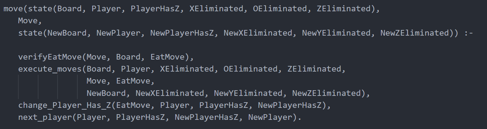

Este predicado recebe como primeiro parâmetro o estado de jogo atual, como segundo a jogada a efetuar e como terceiro(valor a retornar) o novo estado de jogo que irá existir depois da jogada.  
Como se pode ver este predicado recorre a outros predicados entre os quais estão:

- verifyEatMove/3: este predicado recebe como primeiro parâmetro a jogada a efetuar, como segundo parâmetor recebe o tabuleiro atual e como terceiro e também valor a retornar uma variável que nos diz se a jogada a efetuar é uma jogada de movimento normal ou se alguma peça é "comida". No fundo é isso que este predicado faz, verifica o tipo de jogada, normal ou uma em que se "come" peças;

- execute_moves/11: este predicado recebe no 1º parâmetro o tabuleiro atual, no 2º o jogador atual, no 3º, 4º e 5º o número de cada peças comidas de cada tipo, 6º a jogada atual, 7º o tipo de jogada, 8º o novo tabuelrio depois da execução da jogada, 9º, 10º e 11º os novos valores de peças comidas de cada tipo depois da execução da jogada. No fundo este predicado executa a jogada  removendo a peça selecionada da posição atual, e colocando-a na nova posição e elimina as peças comidas(se tiver sido alguma);

- change_Player_Has_Z/4: este predicado recebe como 1º parâmetro o tipo de jogada, 2º o jogador atual, 3º jogador que detém posse sobre os zombies e como 4º e valor a retornar o jogador que detém posse sobre os zombies depois da jogada ser executada. No fundo o que este predicado faz é tendo em conta a jogada atual muda ou não o jogador que detém o controlo sobre os zombies;

- next_player/4: este predicado recebe como 1º parâmetro o jogador atual, 2º parâmetro o jogador que tinha posse sobre os zombies antes da jogada ser executada, 3º o jogador que detém posso sobre os zombies depois da executada ser executada e como 4º e valor a retornar quem será o jogador a executar a próxima jogada. No fundo o que este predicado faz é tendo em conta a jogada atual dá-nos quem será o jogador seguinte.

## Final de jogo

Para avaliarmos se o jogo chegou ao fim recorremos ao seguinte predicado game_over/2.
Este predicado recebe como 1º parâmetro o estado atual do jogo e como 2º e valor a retornar o vencedor, caso o jogo ainda não tenha chegado a um fim o predicado falha.  

Se o jogo chegou a um fim significa que atingimos uma das 6 seguintes possibilidades:

- todas as peças X foram eliminadas nesse caso este predicado sussede:

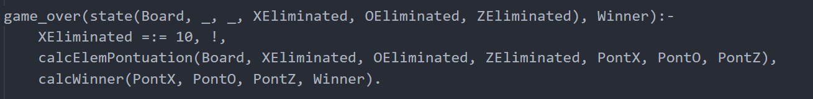

- todas as peças O foram eliminadas nesse caso este predicado sussede:

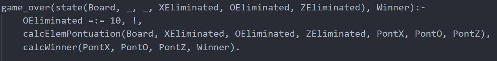

- todas as peças Z foram eliminadas nesse caso este predicado sussede:

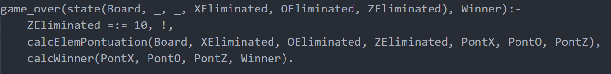

- todas as peças X restantes em tabuleiro estão a tocar a borda do seu tipo:

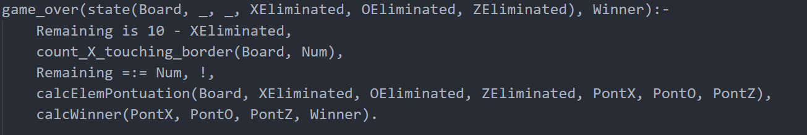

- todas as peças O restantes em tabuleiro estão a tocar a borda do seu tipo:

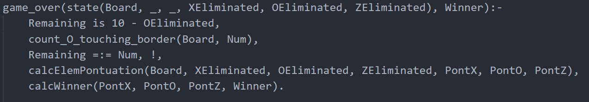

- todas as peças Z restantes em tabuleiro estão a tocar a borda do seu tipo:

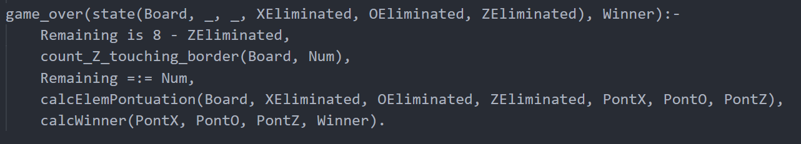

Como se pode ver todos estes predicados têm em comum os dois últimos predicados:

- calcElemPontuation/7: este predicado recebe como 1º parâmetro o tabuleiro atual, 2º, 3º e 4º o número de peças de cada tipo eliminadas e 5º, 6º e 7º e valores a retornar a pontução de cada peça tendo em conta os parâmetros anteriores. No fundo o que este predicado faz é calcular a pontuação de cada tipo de peças;

- calcWinner/4: este predicado recebe como 1º, 2º e 3º parâmetros as pontuações de cada peça e como 4º e valor a retornar o vencedor ou em caso de empate este parâmtro fica em branco. No fundo o que este predicado faz é calcular o vencedor tendo em conta a pontuação de cada tipo de peças.

## Avaliação do tabuleiro
A avaliação do tabuleiro é feita através do predicado value/3. Este recebe o estado de jogo Board e o Player e devolve o valor da pontuação do jogador Player em Value. A pontuação de um jogador depende de dois parâmetros, as peças adversárias comidas (1 ponto cada) e o número de peças próprias que se encontram posicionadas na parede do tabuleiro com a cor correspondente (2 pontos cada). O predicado value utiliza duas outras funções para este cálculo:

- calc_value_on_board/4 que recebe o jogador Player e tabuleiro Board e a linha RowNum e devolve em Value o valor da pontuação do número de peças do jogador que se encontram em contacto com as casas da cor correspondente. Todas as linhas do tabuleiro são percorridas recursivamente e o valor vai sendo adicionado a Value.

- calc_value_elim/5 que recebe o jogador Player ('X','Z','O') assim como as peças comidas de cada tipo XElim, OElim, ZElim, e devolve em Value a soma do número de peças comidas de tipos diferentes das do Player.

- O resultado Value resulta da soma das pontuações resultantes de ambas as funções anteriores.

## Jogada do computador
As jogadas do computador são realizadas através do predicado choose_move/4 que recebe o estado de jogo GameState, o jogador Player e o nível de dificuldade Level e devolve a jogada em Move. O predicado tem também uma segunda implementação choose_move/3 onde é passado apenas o nível e uma lista de jogadas ordenada por dificuldades e retorna a jogada adequada em Move.

- No primeiro caso é criada uma lista com as jogadas válidas para o jogador em questão, através do predicado valid_moves. De seguida são calculados os valores de pontuação associados a cada jogada e adicionados a uma outra lista, que será posteriormente ordenada por dificuldade crescente. De seguida é chamado o choose_moves/3, onde é passada a dificuldade ('Easy','Medium','Hard') e a lista ordenada das jogadas com os valores associados

- Quando o nível de dificuldade passado é 'Easy', o predicado devolve a primeira jogada da lista. Quando esta é 'Hard' devolve a última jogada. Se for 'Medium', é devolvida a jogada presente no centro da lista.

# Conclusões
Ao longo da realização do projeto, foi possível uma familiarização do grupo com a linguagem de Prolog. Linguagem esta que requereu um pensamento diferente das linguagens já estudadas previamente. Desta forma, foi possível cumprir os objetivos impostos ao grupo e desenvolver um jogo de tabuleiro funcional e completo.

# Bibliografia

Manual do Sicstus: https://sicstus.sics.se/sicstus/docs/latest4/pdf/sicstus.pdf

Página do Jogo: https://nestorgames.com/rulebooks/GREENSKULL_EN.pdf

---
